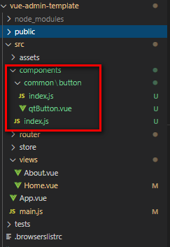

# vue-admin-template

## 简介

vue后台管理项目模板

## 项目运行
- 安装依赖
> npm i | cnpm i | yarn      
- 本地运行   
> npm serve | yarn serve    
- 生产打包   
> npm run build | yarn run build   
- eslint 检查并修复
> npm run lint     

## 相关知识点
------
- [x] [全局注册组件](#全局注册组件)  

### 全局注册组件

1、首先在`components`文件夹下新建一个`common`文件夹，用于放置全局的组件。
其中每一个全局组件里边需要新建一个`index.js`，用于引入组件并导出组件对象。   
```javascript
// components/common/xxx/index.js
// 1. 单个组件引入并导出
import qtButton from './qtButton'
export default qtButton

// 2. 多个组件引入并导出
import component1 from './component1'
import component2 from './component1'
export {
  component1,
  component2
}
```

文件结构如下：   
  

2、在components文件夹下新建一个index.js文件, 用于自动扫描全局组件并注册    
```javascript
// components/index.js
import Vue from 'vue'

// 自动加载common 目录下的.js结尾的文件
const componentsContext = require.context('./common', true, /\.js$/)

const components = []
// 自动注册全局组件
componentsContext.keys().forEach(module => {
  const moduleConfig = componentsContext(module)

  // 判断组件是否默认暴露（即有只有一个组件)
  if (!moduleConfig.default) { // 多个组件时
    Object.values(moduleConfig).forEach(component => {
      components.push(component)
    })
  } else { // 单个组件
    components.push(moduleConfig.default)
  }
})

components.forEach(component => {
  console.log(component)
  Vue.component(component.name, component)
})
```   

3、在入口文件main.js引入`components\index`文件   
```javascript
import './components'
```    
此时就可以愉快的在页面使用全局组件了。   


